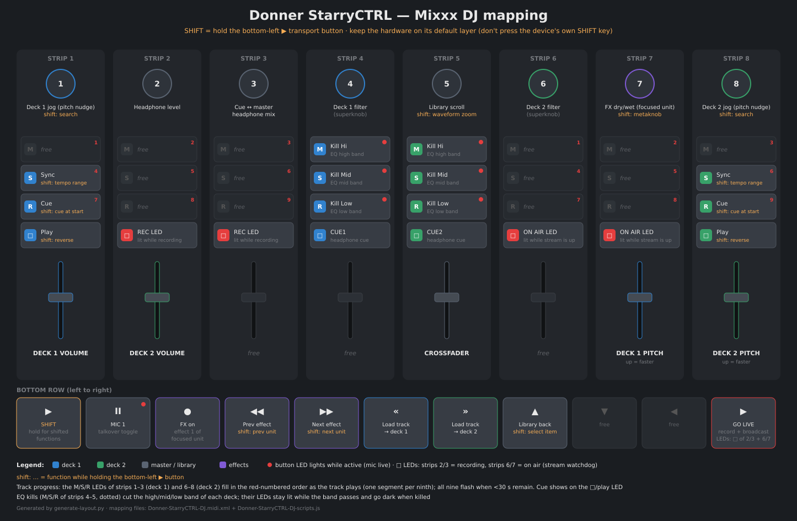

# Donner StarryCTRL — Mixxx DJ mapping

2-deck DJ mapping for the Donner StarryCTRL (hardware-identical to the
M-Vave SMC-Mixer), implementing the layout drawn by Fiachik in the
[Mixxx forum thread](https://mixxx.discourse.group/t/m-wave-sinco-smc-mixer-radio-broadcast-mapping/30366).

## Install

Copy `Donner-StarryCTRL-DJ.midi.xml` and `Donner-StarryCTRL-DJ-scripts.js`
into `~/.mixxx/controllers/`, then pick
**Donner StarryCTRL (DJ)** for the device in Preferences → Controllers.

**Important:** keep the controller on its default layer. The hardware
SHIFT button (top right, below BT) switches the device's internal layer
and changes the MIDI messages it sends — this mapping only covers the
default layer. The mapping's SHIFT is the **bottom-left play transport
button** instead.

## Layout

A visual map of every control is in `layout.png` / `layout.svg`
(regenerate with `python3 generate-layout.py` after mapping changes).

Strips are numbered 1–8 left to right. Each strip is a fader plus a
column of four buttons (M, S, R, □ top to bottom). "Shift" means holding
the bottom-left ▶ transport button.

### Knobs (left to right)

| # | Function | Shift |
|---|----------|-------|
| 1 | Deck 1 jog (pitch nudge) | Jog search (seek) |
| 2 | Headphone level | |
| 3 | Cue/master headphone mix | |
| 4 | Deck 1 superknob (QuickEffect filter) | |
| 5 | Library scroll | Waveform zoom |
| 6 | Deck 2 superknob (QuickEffect filter) | |
| 7 | FX level depth (focused unit dry/wet) | Metaknob (unit super) |
| 8 | Deck 2 jog (pitch nudge) | Jog search (seek) |

### Faders

| Fader | Function |
|-------|----------|
| 1 | Deck 1 volume |
| 2 | Deck 2 volume |
| 3–4 | free |
| 5 | Crossfader |
| 6 | free |
| 7 | Deck 1 pitch (up = faster; flip sign in `rateFader` for DJ-style) |
| 8 | Deck 2 pitch |

### Strip buttons

| Strip | M | S | R | □ |
|-------|---|---|---|---|
| 1 (deck 1) | free ¹ | Sync · *shift: tempo range* ¹ | Cue · *shift: cue at start* ¹ | Play · *shift: reverse* |
| 2 (deck 1) | free ¹ | free ¹ | free ¹ | **REC** LED (button free) |
| 3 (deck 1) | free ¹ | free ¹ | free ¹ | **REC** LED (button free) |
| 4 (deck 1) | Kill high EQ ² | Kill mid EQ ² | Kill low EQ ² | **CUE1** (headphone cue) |
| 5 (deck 2) | Kill high EQ ² | Kill mid EQ ² | Kill low EQ ² | **CUE2** (headphone cue) |
| 6 (deck 2) | free ¹ | free ¹ | free ¹ | **ON AIR** LED (button free) |
| 7 (deck 2) | free ¹ | free ¹ | free ¹ | **ON AIR** LED (button free) |
| 8 (deck 2) | free ¹ | Sync · *shift: tempo range* ¹ | Cue · *shift: cue at start* ¹ | Play · *shift: reverse* |

¹ The M/S/R LEDs of strips 1–3 and 6–8 are track-progress segments (see
below); where a button still has a function the label stands, only its
LED is repurposed.

² EQ kill toggle; the LED is lit while the band passes and goes dark
while the band is killed.

**Track progress bar:** the M, S and R LEDs of strips 1–3 (deck 1) and
6–8 (deck 2) form a 9-segment progress bar that fills like a growing
snake as the track plays — M1 → M2 → M3, then S1 → S2 → S3, then
R1 → R2 → R3, one new segment per ninth of the track. During the last 30
seconds (`endWarningSecs` / `endWarningFlashMs` in the script) all nine
segments flash together as the end-of-track warning; pausing freezes the
bar, and loading the next track clears it. The cue point shows on the
□/play LED (lit while a deck plays or is parked at its cue point), so cue
stays visible even though the bar now owns the whole R row.

Loop controls were removed to simplify the layout. Sync still works on
the strip 1/8 S buttons (shift = tempo range) but no longer has a
dedicated indicator LED.

**EQ kills:** the M, S and R buttons of strips 4 (deck 1) and 5 (deck 2)
toggle the high, mid and low EQ kill switches. Each LED is lit while its
band is passing and goes dark when the band is killed, so the six normally
stay on — which also keeps the middle of the unit lit as a landmark for the
crossfader (fader 5). (The old FX1/FX2 "assign unit to deck" buttons were
removed; set that in the Mixxx GUI if needed.)

### Bottom row (left to right)

| Button | Function | Shift |
|--------|----------|-------|
| ▶ | **SHIFT** (hold) | |
| ⏸ | Mic 1 on/off (talkover) — LED lit while the mic is live | |
| ⏺ | FX on (toggle effect 1 of focused unit) | |
| ⏮ | Previous effect | Previous effect unit |
| ⏭ | Next effect | Next effect unit |
| « | Load selected track → deck 1 | |
| » | Load selected track → deck 2 | |
| ▲ | Library focus back | Select item (GoToItem) |
| ▼ ◀ | free | |
| ▶ (rightmost) | **Go live**: start/stop recording + broadcasting together — indicators on the □ LEDs of strips 2/3 and 6/7 | |

Notes on go live: broadcasting must be configured in Preferences →
Live Broadcasting first, or Mixxx will show an error when enabling it.
The go-live button's own LED is not controllable, so the indicators
sit on otherwise-unused □ buttons: strips 2/3 light while a recording
is running, and strips 6/7 are a stream watchdog — lit only while the
broadcast connection is actually up, going dark the moment the stream
drops or is reconnecting.
Mixxx persists the broadcasting toggle across restarts, so if you quit
while live it may ask to reconnect on the next launch.

## Things to verify on first run (built without the hardware)

1. **Encoder direction** — if knobs work backwards, the device may send
   inverted relative values; swap the sign in `StarryCTRL.ticks`.
2. **Button release messages** — assumed to be note-on with velocity 0
   (matches the official M-Vave mapping). If a held button (e.g. cue)
   never releases, the device sends note-off (0x80) instead; add 0x80
   bindings to the XML.
3. **LEDs** — play/pfl/FX and the progress-bar segments are sent as
   note-on 0x7F / 0x00. The official mapping notes some firmware only
   blinks LEDs.
4. **Strip assignments** — strips 4/5 (FX1/CUE1, FX2/CUE2) and the deck 2
   button placements were read off Fiachik's annotated photo; if a button
   does something unexpected, use Preferences → Controllers → the
   highlighted MIDI activity (or `mixxx --controller-debug`) to see the
   note number and tell me which function landed where.
5. **Pitch fader polarity** — currently fader up = faster.

Tweakable constants (jog sensitivity, search speed, tempo ranges,
end-of-track warning timing, playposition poll rate, number of FX units
cycled) are at the top of the script.
